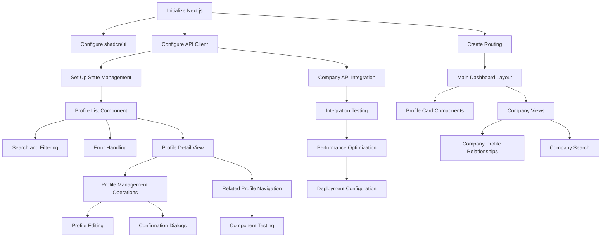

# V1.9 Basic Admin UI - Task Breakdown

> **Feature**: Basic Admin UI with shadcn/ui
> **Version**: 1.9.0
> **Created**: 2025-07-31
> **TDD Focus**: Frontend components with comprehensive testing

## Task Overview

This document provides a comprehensive breakdown of all tasks required to implement the V1.9 Basic Admin UI feature. Each task follows Test-Driven Development (TDD) principles with clear acceptance criteria and testing requirements.

## Phase 1: Project Setup & Core Infrastructure (3-4 days)

### Task 1.1: Initialize Next.js Project
**Estimated Time**: 1 day
**Priority**: CRITICAL
**Dependencies**: None

**Description**: Set up the foundational Next.js application with TypeScript configuration

**Acceptance Criteria**:
- [ ] Next.js 14 project initialized with App Router
- [ ] TypeScript configured with strict mode
- [ ] ESLint and Prettier configured
- [ ] Basic folder structure created
- [ ] Development server runs without errors

**TDD Approach**:
- [ ] Write test for basic page rendering
- [ ] Implement minimal page structure
- [ ] Verify test passes
- [ ] Add additional configuration tests

**Files to Create**:
- `package.json` with dependencies
- `next.config.js` with proper configuration
- `tsconfig.json` with TypeScript settings
- `app/layout.tsx` with basic layout
- `app/page.tsx` with home page

### Task 1.2: Install and Configure shadcn/ui
**Estimated Time**: 0.5 days
**Priority**: HIGH
**Dependencies**: Task 1.1

**Description**: Set up shadcn/ui component library with Tailwind CSS

**Acceptance Criteria**:
- [ ] shadcn/ui CLI installed and initialized
- [ ] Tailwind CSS configured with shadcn/ui theme
- [ ] Basic components installed (Button, Card, Input)
- [ ] Component library accessible in project
- [ ] Storybook configured for component development (optional)

**TDD Approach**:
- [ ] Write tests for basic component rendering
- [ ] Import and use basic shadcn/ui components
- [ ] Verify styling and theme application
- [ ] Test component accessibility features

**Files to Create**:
- `tailwind.config.js` with shadcn/ui configuration
- `components/ui/` directory with base components
- `lib/utils.ts` with utility functions
- Component test files

### Task 1.3: Configure API Client with Authentication
**Estimated Time**: 1 day
**Priority**: HIGH
**Dependencies**: Task 1.1

**Description**: Set up HTTP client for FastAPI backend communication

**Acceptance Criteria**:
- [ ] Axios configured with base URL and interceptors
- [ ] API key authentication implemented
- [ ] Error handling and retry logic added
- [ ] Type-safe API client with TypeScript
- [ ] Environment variable configuration

**TDD Approach**:
- [ ] Write tests for API client instantiation
- [ ] Test authentication header injection
- [ ] Test error handling scenarios
- [ ] Mock API responses for testing

**Files to Create**:
- `lib/api.ts` with API client configuration
- `types/api.ts` with API response types
- `__tests__/api.test.ts` with API client tests
- `.env.local` template for environment variables

### Task 1.4: Create Basic Routing Structure
**Estimated Time**: 0.5 days
**Priority**: MEDIUM
**Dependencies**: Task 1.1

**Description**: Implement navigation structure for the admin interface

**Acceptance Criteria**:
- [ ] App Router pages created for main sections
- [ ] Navigation component with sidebar/top bar
- [ ] Breadcrumb navigation implemented
- [ ] Responsive navigation behavior
- [ ] Active route highlighting

**TDD Approach**:
- [ ] Write tests for route rendering
- [ ] Test navigation component interactions
- [ ] Verify breadcrumb generation
- [ ] Test responsive navigation behavior

**Files to Create**:
- `app/dashboard/page.tsx`
- `app/profiles/page.tsx`
- `app/companies/page.tsx`
- `components/common/Navigation.tsx`
- `components/common/Breadcrumbs.tsx`

### Task 1.5: Set Up State Management
**Estimated Time**: 1 day
**Priority**: MEDIUM
**Dependencies**: Task 1.3

**Description**: Configure React Query and Zustand for state management

**Acceptance Criteria**:
- [ ] React Query configured with proper cache settings
- [ ] Zustand store created for UI state
- [ ] Query keys and hooks organized
- [ ] Error boundary implementation
- [ ] Loading state management

**TDD Approach**:
- [ ] Write tests for React Query hooks
- [ ] Test Zustand store actions and selectors
- [ ] Test error boundary behavior
- [ ] Mock query responses for testing

**Files to Create**:
- `lib/query-client.ts` with React Query setup
- `stores/ui-store.ts` with Zustand store
- `hooks/use-profiles.ts` with custom hooks
- `components/common/ErrorBoundary.tsx`

## Phase 2: Profile Dashboard & List View (4-5 days)

### Task 2.1: Create Main Dashboard Layout
**Estimated Time**: 1.5 days
**Priority**: HIGH
**Dependencies**: Task 1.4

**Description**: Implement the main dashboard with navigation and system overview

**Acceptance Criteria**:
- [ ] Responsive layout with sidebar and main content
- [ ] System statistics cards (profile count, company count)
- [ ] Recent activity feed
- [ ] Health status indicators
- [ ] Mobile-responsive design

**TDD Approach**:
- [ ] Write tests for layout components
- [ ] Test responsive behavior
- [ ] Test statistics card data display
- [ ] Test navigation integration

**Files to Create**:
- `app/dashboard/layout.tsx`
- `components/dashboard/StatisticsCards.tsx`
- `components/dashboard/RecentActivity.tsx`
- `components/dashboard/HealthStatus.tsx`

### Task 2.2: Implement Profile List Component
**Estimated Time**: 2 days
**Priority**: HIGH
**Dependencies**: Task 1.5

**Description**: Create profile listing with pagination and loading states

**Acceptance Criteria**:
- [ ] Profile cards with essential information
- [ ] Pagination with proper navigation
- [ ] Loading skeletons while fetching data
- [ ] Empty state handling
- [ ] Infinite scroll or traditional pagination

**TDD Approach**:
- [ ] Write tests for profile card rendering
- [ ] Test pagination logic and navigation
- [ ] Test loading and empty states
- [ ] Mock profile data for consistent testing

**Files to Create**:
- `components/profile/ProfileCard.tsx`
- `components/profile/ProfileList.tsx`
- `components/common/Pagination.tsx`
- `components/common/LoadingSkeleton.tsx`

### Task 2.3: Add Search and Filtering Functionality
**Estimated Time**: 2 days
**Priority**: HIGH
**Dependencies**: Task 2.2

**Description**: Implement real-time search and filtering for profiles

**Acceptance Criteria**:
- [ ] Search input with debounced queries
- [ ] Filter dropdowns for company, industry, location
- [ ] Sort options (date, name, company)
- [ ] Clear filters functionality
- [ ] Search result highlighting

**TDD Approach**:
- [ ] Write tests for search input behavior
- [ ] Test debounce functionality
- [ ] Test filter combinations
- [ ] Test search result display

**Files to Create**:
- `components/profile/SearchBar.tsx`
- `components/profile/FilterPanel.tsx`
- `components/profile/SortOptions.tsx`
- `hooks/use-search.ts`

### Task 2.4: Implement Error Handling and Loading States
**Estimated Time**: 1 day
**Priority**: MEDIUM
**Dependencies**: Task 2.2

**Description**: Add comprehensive error handling and loading indicators

**Acceptance Criteria**:
- [ ] Error messages for API failures
- [ ] Retry mechanisms for failed requests
- [ ] Loading indicators for all async operations
- [ ] Graceful degradation for partial failures
- [ ] User-friendly error messages

**TDD Approach**:
- [ ] Write tests for error scenarios
- [ ] Test retry logic
- [ ] Test loading state transitions
- [ ] Mock API errors for testing

**Files to Create**:
- `components/common/ErrorMessage.tsx`
- `components/common/LoadingSpinner.tsx`
- `components/common/RetryButton.tsx`
- `hooks/use-error-handler.ts`

### Task 2.5: Create Profile Card Components
**Estimated Time**: 1.5 days
**Priority**: MEDIUM
**Dependencies**: Task 2.1

**Description**: Design and implement profile card components for list view

**Acceptance Criteria**:
- [ ] Compact profile information display
- [ ] Profile photo with fallback
- [ ] Quick action buttons (view, delete)
- [ ] Status indicators (recent, updated)
- [ ] Hover effects and interactions

**TDD Approach**:
- [ ] Write tests for card rendering
- [ ] Test action button functionality
- [ ] Test hover and interaction states
- [ ] Test profile photo fallback

**Files to Create**:
- `components/profile/ProfileCard.tsx`
- `components/profile/ProfilePhoto.tsx`
- `components/profile/QuickActions.tsx`
- `components/common/StatusBadge.tsx`

## Phase 3: Profile Detail & Management (3-4 days)

### Task 3.1: Create Detailed Profile View Component
**Estimated Time**: 2 days
**Priority**: HIGH
**Dependencies**: Task 2.2

**Description**: Implement comprehensive profile detail page

**Acceptance Criteria**:
- [ ] Full profile information display
- [ ] Experience timeline visualization
- [ ] Associated company information
- [ ] Skills and endorsements display
- [ ] Contact information (if available)

**TDD Approach**:
- [ ] Write tests for profile detail rendering
- [ ] Test data transformation and display
- [ ] Test nested component interactions
- [ ] Test responsive layout behavior

**Files to Create**:
- `app/profiles/[id]/page.tsx`
- `components/profile/ProfileDetail.tsx`
- `components/profile/ExperienceTimeline.tsx`
- `components/profile/SkillsList.tsx`

### Task 3.2: Implement Profile Management Operations
**Estimated Time**: 1.5 days
**Priority**: HIGH
**Dependencies**: Task 3.1

**Description**: Add CRUD operations for profile management

**Acceptance Criteria**:
- [ ] Delete profile with confirmation dialog
- [ ] Re-ingest profile functionality
- [ ] Edit profile metadata (tags, notes)
- [ ] Bulk operation support
- [ ] Optimistic updates for better UX

**TDD Approach**:
- [ ] Write tests for CRUD operations
- [ ] Test confirmation dialogs
- [ ] Test optimistic update behavior
- [ ] Test bulk operation logic

**Files to Create**:
- `components/profile/ProfileActions.tsx`
- `components/profile/DeleteConfirmation.tsx`
- `components/profile/ReIngestDialog.tsx`
- `components/profile/BulkActions.tsx`

### Task 3.3: Add Profile Editing Capabilities
**Estimated Time**: 1.5 days
**Priority**: MEDIUM
**Dependencies**: Task 3.2

**Description**: Implement profile editing forms and validation

**Acceptance Criteria**:
- [ ] Form components for profile editing
- [ ] Client-side validation with Zod schemas
- [ ] Real-time form validation feedback
- [ ] Auto-save functionality
- [ ] Unsaved changes warning

**TDD Approach**:
- [ ] Write tests for form validation
- [ ] Test form submission and error handling
- [ ] Test auto-save functionality
- [ ] Test unsaved changes detection

**Files to Create**:
- `components/profile/ProfileEditForm.tsx`
- `components/forms/FormField.tsx`
- `lib/validations.ts`
- `hooks/use-form-auto-save.ts`

### Task 3.4: Create Confirmation Dialogs and Forms
**Estimated Time**: 1 day
**Priority**: MEDIUM
**Dependencies**: Task 3.2

**Description**: Implement reusable dialog and form components

**Acceptance Criteria**:
- [ ] Confirmation dialog component
- [ ] Form dialog wrapper
- [ ] Keyboard navigation support
- [ ] Accessibility compliance (ARIA labels)
- [ ] Animation and transition effects

**TDD Approach**:
- [ ] Write tests for dialog functionality
- [ ] Test keyboard navigation
- [ ] Test accessibility features
- [ ] Test dialog state management

**Files to Create**:
- `components/common/ConfirmationDialog.tsx`
- `components/common/FormDialog.tsx`
- `components/common/Modal.tsx`
- `hooks/use-dialog.ts`

### Task 3.5: Implement Navigation Between Related Profiles
**Estimated Time**: 0.5 days
**Priority**: LOW
**Dependencies**: Task 3.1

**Description**: Add navigation to related profiles and companies

**Acceptance Criteria**:
- [ ] "Related Profiles" section
- [ ] Navigation to company profiles
- [ ] "People from same company" feature
- [ ] Breadcrumb navigation updates
- [ ] Back/forward navigation support

**TDD Approach**:
- [ ] Write tests for related profile queries
- [ ] Test navigation functionality
- [ ] Test breadcrumb updates
- [ ] Test browser history integration

**Files to Create**:
- `components/profile/RelatedProfiles.tsx`
- `components/profile/CompanyProfiles.tsx`
- `hooks/use-related-profiles.ts`

## Phase 4: Company Views & Integration (2-3 days)

### Task 4.1: Create Company Listing and Detail Views
**Estimated Time**: 1.5 days
**Priority**: MEDIUM
**Dependencies**: Task 2.1

**Description**: Implement company management interface

**Acceptance Criteria**:
- [ ] Company list with search and filtering
- [ ] Company detail view with full information
- [ ] Employee count and profile associations
- [ ] Company logo and branding display
- [ ] Industry and location information

**TDD Approach**:
- [ ] Write tests for company list rendering
- [ ] Test company detail view functionality
- [ ] Test company-profile relationships
- [ ] Test search and filter logic

**Files to Create**:
- `app/companies/page.tsx`
- `app/companies/[id]/page.tsx`
- `components/company/CompanyCard.tsx`
- `components/company/CompanyDetail.tsx`

### Task 4.2: Implement Company-Profile Relationships
**Estimated Time**: 1 day
**Priority**: HIGH
**Dependencies**: Task 4.1

**Description**: Show profile-company relationships and associations

**Acceptance Criteria**:
- [ ] List profiles associated with each company
- [ ] Show employment history and roles
- [ ] Filter profiles by employment period
- [ ] Navigate between company and profile views
- [ ] Display relationship metadata

**TDD Approach**:
- [ ] Write tests for relationship queries
- [ ] Test profile filtering by company
- [ ] Test navigation between views
- [ ] Test relationship metadata display

**Files to Create**:
- `components/company/CompanyProfiles.tsx`
- `components/company/EmploymentHistory.tsx`
- `hooks/use-company-profiles.ts`

### Task 4.3: Add Company Search and Filtering
**Estimated Time**: 1 day
**Priority**: MEDIUM
**Dependencies**: Task 4.1

**Description**: Implement search and filtering for company data

**Acceptance Criteria**:
- [ ] Text search across company names and descriptions
- [ ] Filter by industry, size, location
- [ ] Sort by employee count, company age
- [ ] Advanced search with multiple criteria
- [ ] Search result highlighting

**TDD Approach**:
- [ ] Write tests for company search functionality
- [ ] Test filter combinations
- [ ] Test sorting options
- [ ] Test search result display

**Files to Create**:
- `components/company/CompanySearch.tsx`
- `components/company/CompanyFilters.tsx`
- `hooks/use-company-search.ts`

### Task 4.4: Integrate with Existing Company API Endpoints
**Estimated Time**: 0.5 days
**Priority**: HIGH
**Dependencies**: Task 1.3

**Description**: Connect company UI components with FastAPI backend

**Acceptance Criteria**:
- [ ] API calls for company listing and details
- [ ] Proper error handling for company endpoints
- [ ] Caching strategy for company data
- [ ] Loading states for company operations
- [ ] Data transformation for UI consumption

**TDD Approach**:
- [ ] Write tests for API integration
- [ ] Test error handling scenarios
- [ ] Test caching behavior
- [ ] Mock API responses for testing

**Files to Create**:
- `hooks/use-companies.ts`
- `lib/api/companies.ts`
- API integration tests

## Phase 5: Testing & Deployment (2-3 days)

### Task 5.1: Comprehensive Testing of UI Components
**Estimated Time**: 1.5 days
**Priority**: HIGH
**Dependencies**: All previous tasks

**Description**: Complete testing coverage for all UI components

**Acceptance Criteria**:
- [ ] Unit tests for all components (>90% coverage)
- [ ] Integration tests for component interactions
- [ ] Visual regression tests for UI consistency
- [ ] Accessibility tests for WCAG compliance
- [ ] Performance tests for component rendering

**TDD Approach**:
- [ ] Review and enhance existing component tests
- [ ] Add missing test scenarios
- [ ] Implement visual regression testing
- [ ] Add accessibility testing suite

**Files to Create**:
- Comprehensive test suite files
- Visual regression test configuration
- Accessibility test utilities
- Performance test benchmarks

### Task 5.2: Integration Testing with FastAPI Backend
**Estimated Time**: 1 day
**Priority**: HIGH
**Dependencies**: Task 5.1

**Description**: End-to-end testing with actual backend integration

**Acceptance Criteria**:
- [ ] E2E tests for complete user workflows
- [ ] API integration tests with real endpoints
- [ ] Error scenario testing with backend
- [ ] Performance testing under load
- [ ] Cross-browser compatibility testing

**TDD Approach**:
- [ ] Write E2E test scenarios
- [ ] Test API integration points
- [ ] Test error handling with real API
- [ ] Performance testing with realistic data

**Files to Create**:
- `__tests__/e2e/` directory with E2E tests
- API integration test suites
- Performance test configurations
- Cross-browser test setup

### Task 5.3: Performance Optimization and Caching
**Estimated Time**: 1 day
**Priority**: MEDIUM
**Dependencies**: Task 5.2

**Description**: Optimize application performance and implement caching

**Acceptance Criteria**:
- [ ] Code splitting and lazy loading
- [ ] Image optimization and lazy loading
- [ ] API response caching strategy
- [ ] Bundle size optimization
- [ ] Lighthouse score >90 for performance

**TDD Approach**:
- [ ] Write performance tests
- [ ] Test caching behavior
- [ ] Test lazy loading functionality
- [ ] Benchmark performance improvements

**Files to Create**:
- Performance optimization configurations
- Caching implementation
- Lazy loading components
- Performance monitoring setup

### Task 5.4: Deployment Configuration for Railway
**Estimated Time**: 0.5 days
**Priority**: HIGH
**Dependencies**: Task 5.3

**Description**: Configure deployment pipeline for Railway hosting

**Acceptance Criteria**:
- [ ] Railway deployment configuration
- [ ] Environment variable setup
- [ ] Build and deployment scripts
- [ ] Health check endpoints
- [ ] Production environment configuration

**TDD Approach**:
- [ ] Test deployment process
- [ ] Verify environment configuration
- [ ] Test health check functionality
- [ ] Validate production build

**Files to Create**:
- `railway.toml` or deployment configuration
- Build scripts and configuration
- Environment variable templates
- Health check endpoints

## Task Dependencies Graph

## Risk Assessment

### High Risk Tasks
- **Task 1.3**: API Client Configuration - Complex authentication and error handling
- **Task 2.3**: Search and Filtering - Real-time updates and performance considerations
- **Task 3.2**: Profile Management Operations - Data consistency and error recovery

### Medium Risk Tasks
- **Task 1.2**: shadcn/ui Configuration - Component library integration complexity
- **Task 5.2**: Integration Testing - Dependent on backend API stability

### Mitigation Strategies
1. **Early API Testing**: Validate API endpoints early in development
2. **Incremental Development**: Implement features incrementally with testing
3. **Fallback Mechanisms**: Implement graceful degradation for API failures
4. **Performance Monitoring**: Continuous performance testing during development

## Success Criteria Checklist

### Functional Requirements
- [ ] All profile CRUD operations working through UI
- [ ] Search and filtering functionality operational
- [ ] Company-profile relationship views complete
- [ ] Responsive design across desktop and tablet
- [ ] API integration working reliably

### Technical Requirements
- [ ] >90% test coverage for components
- [ ] <2 second page load times
- [ ] <500ms search response times
- [ ] Lighthouse performance score >90
- [ ] WCAG AA accessibility compliance

### User Experience Requirements
- [ ] Intuitive navigation and workflow
- [ ] Clear error messages and feedback
- [ ] Consistent visual design
- [ ] Proper loading states and transitions
- [ ] Mobile-friendly interface (basic support)

## Quality Assurance Checklist

### Code Quality
- [ ] TypeScript strict mode compliance
- [ ] ESLint and Prettier configuration
- [ ] Consistent component patterns
- [ ] Proper error boundary implementation
- [ ] Security best practices followed

### Testing Quality
- [ ] Comprehensive unit test coverage
- [ ] Integration tests for API calls
- [ ] E2E tests for user workflows
- [ ] Accessibility testing completed
- [ ] Performance testing passed

### Deployment Quality
- [ ] Production build optimization
- [ ] Environment configuration secure
- [ ] Health check endpoints working
- [ ] Monitoring and logging configured
- [ ] Rollback procedures documented
